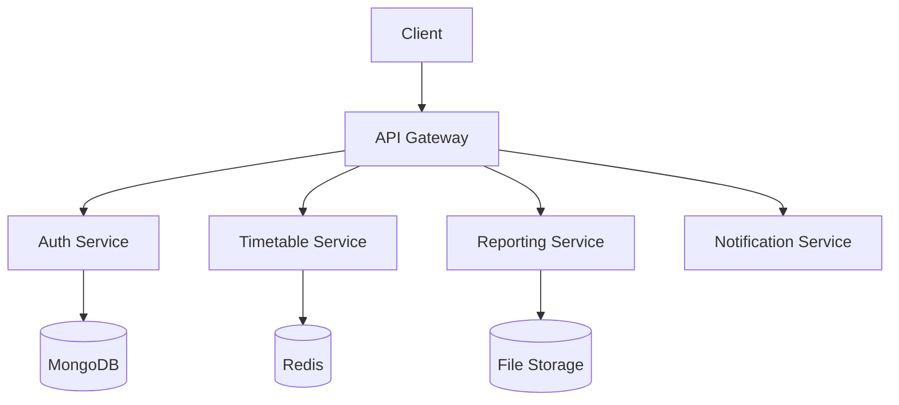
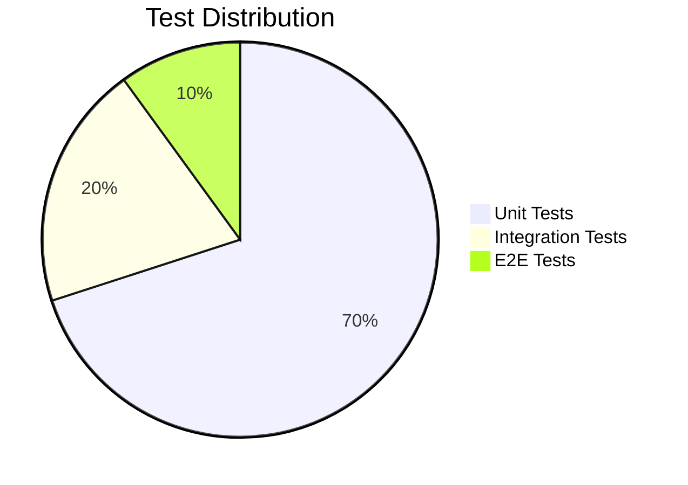

# Academic Scheduler - Conflict-Free Timetable Management System 📅
https://dancing-entremet-155108.netlify.app/

## Enhanced Project Overview 🌟

The Academic Scheduler is an intelligent, full-stack web application designed to revolutionize academic scheduling in educational institutions. Leveraging advanced algorithms and modern web technologies, the system automates the complex process of creating conflict-free timetables while optimizing resource allocation across faculty, courses, and physical spaces.


## Technology Deep Dive ⚙️

### Frontend Architecture 🎨
- **React 18** with Concurrent Mode for responsive UI
- **Redux Toolkit** for state management with RTK Query
- **Material-UI v5** with custom theme system
- **React Hook Form** for complex form handling
- **Framer Motion** for micro-interactions
- **React Big Calendar** for timetable visualization
- **Chart.js 3** with Tree-shaking for optimized bundles

### Backend Services 🛠️
- **Express.js** with RESTful API design
- **MongoDB Atlas** with Mongoose ODM
- **Redis** for caching frequent queries
- **JWT** with refresh token rotation
- **Socket.IO** for real-time updates
- **Swagger** for API documentation

### Advanced Features
- **Genetic Algorithm** for timetable optimization
- **Conflict Detection Engine** with multiple constraint types
- **PDF Generation** with dynamic templates
- **Excel Import/Export** for bulk operations
- **Role-Based Access Control** (RBAC)

## System Architecture 🏗️



## Core Features Expansion 💫

### Intelligent Scheduling Engine
- Multi-dimensional constraint satisfaction:
  - Faculty availability
  - Room capacity and equipment
  - Student group conflicts
  - Specialization requirements
- Priority-based scheduling
- Manual override capabilities
- What-if scenario simulation

### Comprehensive Academic Management
- **Course Lifecycle**:
  - Version control for curriculum changes
  - Prerequisite visualization
  - Credit hour tracking
- **Faculty Module**:
  - Workload balancing
  - Expertise mapping
  - Leave management integration
- **Student Portal**:
  - Conflict-free registration
  - Personalized timetable views
  - Mobile-friendly interface

### Advanced Reporting Suite
- **Operational Reports**:
  - Room utilization analytics
  - Faculty workload distribution
  - Student enrollment trends
- **Strategic Reports**:
  - Long-term capacity planning
  - Resource requirement forecasting
  - Curriculum gap analysis
- **Export Formats**:
  - Interactive PDFs with drill-down
  - Excel with pivot capabilities
  - CSV for data science workflows

## Development Environment Setup 🛠️

### Containerized Development
```bash
# Using Docker Compose
docker-compose -f docker-compose.dev.yml up --build

# Access containers
docker exec -it scheduler-frontend bash
docker exec -it scheduler-backend bash
```

### Microservices Architecture
```bash
# Running services independently
cd services/auth-service && npm run dev
cd services/timetable-service && npm run dev
cd services/api-gateway && npm run start
```

### CI/CD Pipeline
1. **Pre-commit Hooks**:
   - ESLint + Prettier
   - Unit test validation
   - Dependency checks

2. **GitHub Actions**:
   - Automated testing matrix
   - SonarCloud integration
   - Docker image builds

3. **Deployment**:
   - Kubernetes manifests for production
   - Helm charts for environment management
   - ArgoCD for GitOps

## Testing Strategy 🧪

### Test Pyramid Implementation


### Testing Tools
- **Jest** + **React Testing Library** for frontend
- **Mocha** + **Chai** for backend
- **Cypress** for E2E testing
- **Postman** for API contract testing
- **LoadTest** for performance testing

### Sample Test Scenario
```javascript
describe('Timetable Conflict Detection', () => {
  it('should identify room double-booking', async () => {
    const testCase = mockConflictScenario();
    const result = await detectConflicts(testCase);
    expect(result.conflicts).toHaveLength(1);
    expect(result.conflicts[0].type).toBe('ROOM');
  });
});
```

## Performance Optimization 🚀

### Frontend
- Code splitting with React.lazy()
- Image optimization pipeline
- Service worker for caching
- Virtualized lists for large datasets

### Backend
- MongoDB indexing strategy
- Redis caching layer
- Connection pooling
- Query optimization hooks

## Security Measures 🔒

### Implementation
- OWASP Top 10 protection
- CSP headers
- Rate limiting
- SQL injection prevention
- Regular dependency audits

### Compliance
- GDPR-ready features
- FERPA considerations
- Accessibility (WCAG 2.1 AA)

## Monitoring & Observability 👀

### Implemented Solutions
- Prometheus + Grafana dashboards
- ELK Stack for logging
- Sentry for error tracking
- Custom health checks

### Key Metrics
- API response times
- Error rates
- Concurrent users
- Schedule generation duration

## Documentation System 📚

### Living Documentation
- **Storybook** for UI components
- **Swagger UI** for API endpoints
- **JSDoc** for code documentation
- **Architecture Decision Records**

### User Guides
- Administrator manual
- Faculty quick start
- Student orientation
- API integration guide

## Roadmap 🗺️

### Q3 2023
- [ ] Mobile app development
- [ ] Zoom integration for hybrid classes
- [ ] Advanced conflict resolution UI

### Q4 2023
- [ ] Machine learning for predictive scheduling
- [ ] Multi-institution support
- [ ] Curriculum mapping tools

### 2024
- [ ] Degree audit integration
- [ ] Learning analytics dashboard
- [ ] Blockchain for credential verification

## Community & Support 🌍

### Contribution Pathways
1. **Code Contributions**:
   - Good first issues labeled
   - Hackathon events
   - Plugin system development

2. **Non-Code Contributions**:
   - Documentation improvements
   - Localization support
   - User experience testing

### Support Channels
- **GitHub Discussions** for community engagement
- **Dedicated Support Portal** for bug reporting
- **Bi-weekly Webinars** for training
- **Email Support** for registered users

## License & Governance 📜

### Licensing
- Open Source under MIT License
- Code freely available on GitHub
- Documentation under CC BY 4.0

### Project Leadership
- Core development team
- Academic advisory board
- Technical steering committee

---

🎓 **Experience efficient academic scheduling!** Check out our [GitHub repository](https://github.com/academic-scheduler) or reach out through [GitHub Discussions](https://github.com/academic-scheduler/discussions).

Built with passion by students, for students | [Report Issues](https://github.com/academic-scheduler/issues) | [Fork on GitHub](https://github.com/academic-scheduler/fork)
